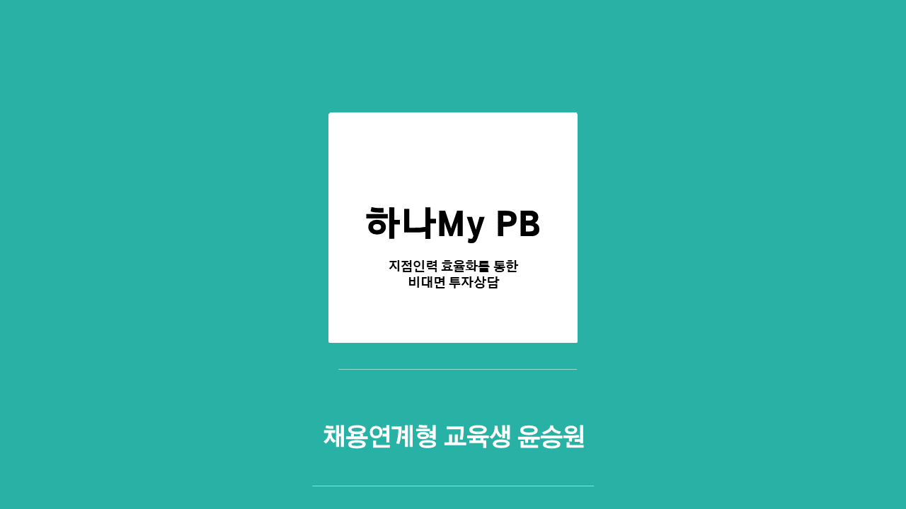

# 하나My PB - 지점인력 효율화를 통한 비대면 투자상담

[프로젝트 홈페이지](https://koposoftware.github.io/2021_11_swyoon/)

# 1. 프로젝트 개요

### 프로젝트 개요
현재 금융권은 비대면, 디지털화로 인해 비용 절감을 위한 지점 축소를 진행중입니다. 하지만, 급격한 지점 축소로 인해 지점당 직원수는 증가하여, 증가한 인력을 효율적으로 관리해야 하는 필요성을 인지했습니다.

### 프로젝트 목적
- 은행, 증권사 PB 직원들의 비어있는 예약 시간대를 활용한 비대면 투자 상담 서비스 제공합니다.
- 기존의 스마트브랜치 서비스를 개선하여 비대면 채널을 더욱 강화합니다.

# 2. 프로젝트 제안서

   [주제제안서](/proposal.pdf) 
 

# 3. 프로젝트 결과
최종 프로젝트 결과입니다.
## 발표 ppt 
   [발표자료](/최종PPT_윤승원.pdf) 

## 시연 동영상 

   <iframe id="ytplayer" type="text/html" width="640" height="360" src="https://www.youtube.com/embed/6LxbdIjWP04" frameborder="0"></iframe>

# 4. 프로젝트 결과 요약

# 5. 본인소개

|이름 |윤승원||
|연락처 | tmd814(@)naver.com|
|skill set| Frontend - HTML, CSS, Javascript|
| | Backend - Java, Spring, Oracle|
| | Etc - Node.js, Git|
|자격증|정보처리기사, 투자자산운용사|
|수상|폴리텍 창업경진대회 - 입선
|경력사항| 한국투자증권 인턴 (2020.09 ~ 2020.11)|
|경력사항| 하나은행 디지털 도우미 (2020.05 ~ 2020.08)|
