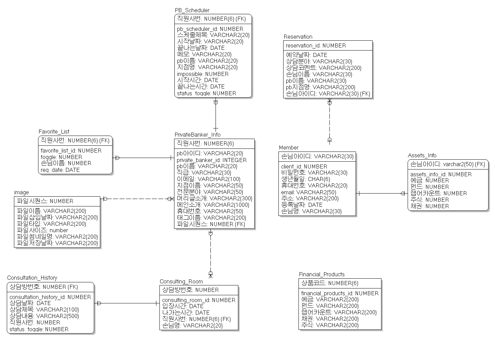

# 하나My PB - 지점인력 효율화를 통한 비대면 투자상담

[프로젝트 홈페이지](https://koposoftware.github.io/2021_11_swyoon/)

# 1. 프로젝트 개요

### 프로젝트 개요
현재 금융권은 비대면, 디지털화로 인해 비용 절감을 위한 지점 축소를 진행중입니다. 하지만, 급격한 지점 축소로 인해 지점당 직원수는 증가하여, 증가한 인력을 효율적으로 관리해야 하는 필요성을 인지했습니다.

### 프로젝트 목적
- 은행, 증권사 PB 직원들의 비어있는 예약 시간대를 활용한 비대면 투자 상담 서비스 제공합니다.
- 기존의 스마트브랜치 서비스를 개선하여 비대면 채널을 더욱 강화합니다.

# 2. 프로젝트 제안서

   [주제제안서](/proposal.pdf) 
 

# 3. 프로젝트 결과
최종 프로젝트 결과입니다.
## 발표 ppt 
   [발표자료](/최종PPT_윤승원.pdf) 

## 시연 동영상 

   <iframe id="ytplayer" type="text/html" width="640" height="360" src="https://youtu.be/BtReb0QVJbE" frameborder="0"></iframe>

# 4. 프로젝트 결과 요약

## * 수행기간
   2021-09-06 ~ 2021-10-05

## * 담당업무
   하나My PB 설계 및 제작, 코딩

## * 주요기능
   

## * 사용기술
- Spring MVC 기반 웹 애플리케이션 제작
- WebRTC API를 활용한 Video Chat & Screen Shring
- Kakao API를 이용한 카카오 알림 전송
- FullCalender 라이브러리를 활용한 캘린더 구현
- Sock Js를 통한 실시간 알림&채팅 구현 
## * 개발환경
- OS : Window10, Linux CentOS7, Mac OS
- Framework : Spring Framework 5, Mybatis
- Server : Apache Tomcat9, Express
- Language : Java(jdk-1.8), Javascript, HTML, CSS
- IDE Tools : Eclipse, Sqldeveloper, IntelliJ
- DB : Oracle 19c
- etc : Node.js, git

## * 개발 아키텍쳐
   
   
## * ERD
   

## * 기대효과

### 1. 자산관리 서비스의 접근성 강화
- 기존의 Private Banking 서비스는 자산 규모가 있는 손님들을 대상으로, 주로 오프라인 지점에서 진행됨 → 비대면 상담을 통해 공간적 제약에서 벗어나, 분야별 다양한 PB 직원에게 상담을 받을 수 있음

### 2. 손님층 확대
- 현재 비대면 화상상담은 초고액 자산가들을 대상으로 시행되고 있음. → 전국에 있는 지점 PB직원을 활용하기에, 상담 인력 증가에 따른 서비스 제공률 증가 → 더 많은 손님들에게 투자 상담 기회 제공

## * 보완점

### 1. 네트워크 보안 지식 보완
- video 정보를 가져오는 과정에서 보안 문제에 직면함 → OpenSSL을 통해 해결했지만, 취약 이슈가 빈번하게 발생한다는 것을 깨닫고 보안의 중요성 인지

### 2. 화상 상담 기록 기능 추가
- 금융권의 불완전 판매 이슈로 인해 판매 절차 강화 필요성 증가 

### 3. 원스톱 서비스 구축
- 예약•상담•가입의 프로세스를 한번에 진행할 수 있는 서비스 구축 필요

# 5. 본인소개

|이름 |윤승원||
|연락처 | tmd814(@)naver.com|
|skill set| Frontend - HTML, CSS, Javascript|
| | Backend - Java, Spring, Oracle|
| | Etc - Node.js, Git|
|자격증|정보처리기사, 투자자산운용사|
|수상|폴리텍 창업경진대회 - 입선
|경력사항| 한국투자증권 인턴 (2020.09 ~ 2020.11)|
|경력사항| 하나은행 디지털 도우미 (2020.05 ~ 2020.08)|
